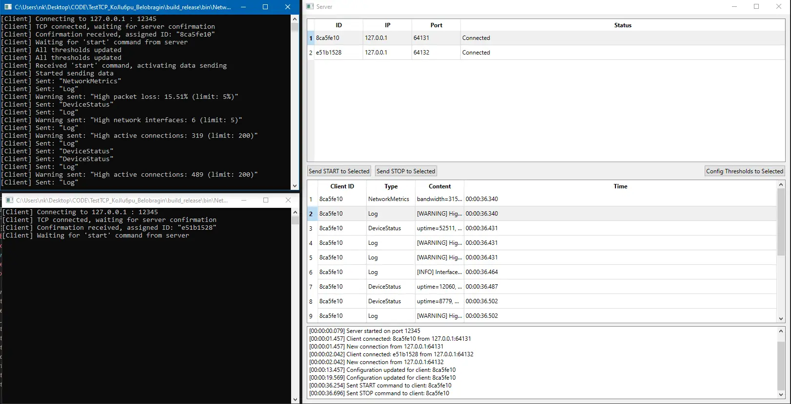

# Тестовое задание

Клиент-серверное приложение для телекоммуникационной системы на C++17 и Qt 6. Сервер (GUI) принимает подключения от клиентов (консольных приложений), получает от них данные в формате JSON и отображает их в таблицах.

  
*Интерфейс сервера и 2ух клиентов* 

## Возможности

**Сервер:**
- Приём множественных TCP-подключений на порту 12345
- Отображение списка клиентов (ID, IP, порт, статус)
- Отображение получаемых данных (тип, содержимое, время)
- Просмотр сообщения при наведении (тултип) или двойном клике на соответствующую строку
- Управление клиентами: команды Start/Stop отправки данных
- Лог событий подключения/отключения/ошибок
- Конфигурация пороговых значений для каждого клиента (23 параметра: 11 для метрик сети, 12 для состояний устройства)
- При превышении пороговых лимитов клиент автоматически генерирует и отправляет отдельные Log-пакеты с `severity: "WARNING"`
- Сетевая логика вынесена в отдельный поток (`ServerWorker` + `QThread`)

**Клиент:**
- Автоподключение к серверу с реконнектом каждые 5 секунд, в случае отсутствия соединения
- Ожидание подтверждения и команды Start перед отправкой данных
- Генерация трёх типов JSON-сообщений: `NetworkMetrics`, `DeviceStatus`, `Log`
- Случайная задержка между отправками (10–100 мс)
- Варьирование длины сообщений (короткие/средние/длинные)
- Обработка команд Start/Stop от сервера

**Сценарий работы:**
1. Сервер автоматически начинает слушать порт 12345
2. Клиенты подключаются, получают подтверждение
3. В GUI сервера появляются строки клиентов со статусом "Connected"
4. Пользователь может нажать "Config Selected Client", чтобы задать 23 пороговых значения для конкретного устройства.
5. Пользователь выделяет клиента и нажимает "Send START"
6. Клиент начинает отправлять JSON-данные. Если значения метрик превышают заданные пороги, клиент автоматически шлёт дополнительные Log-пакеты с предупреждениями.
7. Данные (включая предупреждения) появляются во второй таблице сервера.
8. Кнопка "Send STOP" останавливает отправку данных.

## Структура проекта

```
\TestTCP_Belobragin/
├── .gitignore
├── .github/
│   └── workflows/
│       └── build.yml              # GitHub Actions CI
├── README.md
├── CMakeLists.txt                 # Корневой CMake
└── src/
    ├── protocol.h                 # Общий протокол (константы, парсинг)
    ├── client/
    │   ├── CMakeLists.txt
    │   ├── main.cpp
    │   ├── data_generator.h/cpp
    │   └── network_client.h/cpp
    └── server/
        ├── CMakeLists.txt
        ├── main.cpp
        ├── server_window.h/cpp
        ├── config_dialog.h/cpp
        └── server_worker.h/cpp
```


## Сборка

### Требования
- CMake 3.19+
- Qt 6.5+ (протестировано на собранном из исходников 6.5.2)
- MSVC 2022
- Ninja (рекомендуется)

### Сборка в Qt Creator
1. Открыть корневой `CMakeLists.txt` через File -> Open Project...
2. Выбрать на вкладке Project требуемый kit с подходящей версией Qt
3. Build (Ctrl+B)

### Локальная сборка (Windows + MSVC)

```bash
# Инициализация окружения MSVC, с указанием разрядности, а также версии используемого набора MSVC
"C:\Program Files (x86)\Microsoft Visual Studio\18\BuildTools\VC\Auxiliary\Build\vcvarsall.bat" x64 -vcvars_ver=14.44

# Конфигурация и сборка, с указанием пути к конкретной версии библиотеки
# (напр., если как я собирали разные версии из исходников вручную)
cmake -S . -B build_release -G Ninja -DCMAKE_BUILD_TYPE=Release -DCMAKE_PREFIX_PATH=C:\Qt\6.5.2\msvc2022_64
cmake --build build_release

# Упаковка Qt-зависимостей для создания Portable-версии
C:\Qt\6.5.2\msvc2022_64\bin\windeployqt6.exe build_release\bin\NetworkClient.exe
C:\Qt\6.5.2\msvc2022_64\bin\windeployqt6.exe build_release\bin\NetworkServer.exe
```

### Определение путей и версий MSVC

```bash
# Найти пути к Microsoft Visual Studio
cd C:\
dir /s /b "C:\cl.exe"

# Узнать какие версии MSVC установлены
dir "C:\Program Files (x86)\Microsoft Visual Studio\18\BuildTools\VC\Tools\MSVC"

# Узнать какие версии Windows SDK установлены
dir "C:\Program Files (x86)\Windows Kits\10\Include"
```


## Архитектура

### Сервер
- `ServerWindow` — GUI, работает в главном потоке
- `ServerWorker` — сетевая логика, работает в отдельном `QThread`
- Взаимодействие между потоками через сигналы/слоты Qt (автоматически `Qt::QueuedConnection`)

### Клиент
- `NetworkClient` — управление подключением и конечный автомат состояний
- `DataGenerator` — генерация случайных JSON-данных трёх типов
- Конечный автомат: `Disconnected -> Connecting -> Connected -> WaitingForStart <-> Active`

### Протокол
- Транспорт: TCP, порт 12345
- Формат: JSON + символ-разделитель `\n`
- Парсинг через `protocol::TryReadJsonMessage` (решает проблему TCP-фрейминга)

## Типы сообщений

**От клиента к серверу:**
```json
{"type": "NetworkMetrics", "bandwidth": 100.5, "latency": 12.3, "packet_loss": 0.01}
{"type": "DeviceStatus", "uptime": 3600, "cpu_usage": 25, "memory_usage": 60}
{"type": "Log", "message": "Interface eth0 restarted", "severity": "INFO"}
// Автоматически генерируется клиентом при превышении порогов:
{"type": "Log", "message": "High CPU usage: 85% (limit: 80%)", "severity": "WARNING"}
```

**От сервера к клиенту:**
```json
{"status": "connected", "clientId": "a1b2c3d4"}    // Подтверждение подключения
{"command": "start"}                               // Команда начать отправку
{"command": "stop"}                                // Команда остановить отправку
{"command": "set_config", "config": {"max_cpu_usage": 80, "max_latency": 100.0, ...}} // Обновление 23 порогов
```


## Известные ограничения

### Переподключение клиентов
При разрыве соединения и последующем переподключении клиент получает **новый ID**, а старая строка в таблице остаётся со статусом "Disconnected". Это связано с тем, что каждый запуск exe клиента эмулирует новое устройство.

**Для продакшена:** рекомендуется реализовать механизм, при котором сервер при первом подключении генерирует ID и отправляет его клиенту. Клиент сохраняет этот ID в памяти и при последующих переподключениях отправляет его обратно. Сервер проверяет: если ID уже присутствует в таблице, обновляет статус существующей строки на "Connected" вместо создания дубликата. Это обеспечит устойчивое отображение клиентов при временных разрывах связи.
